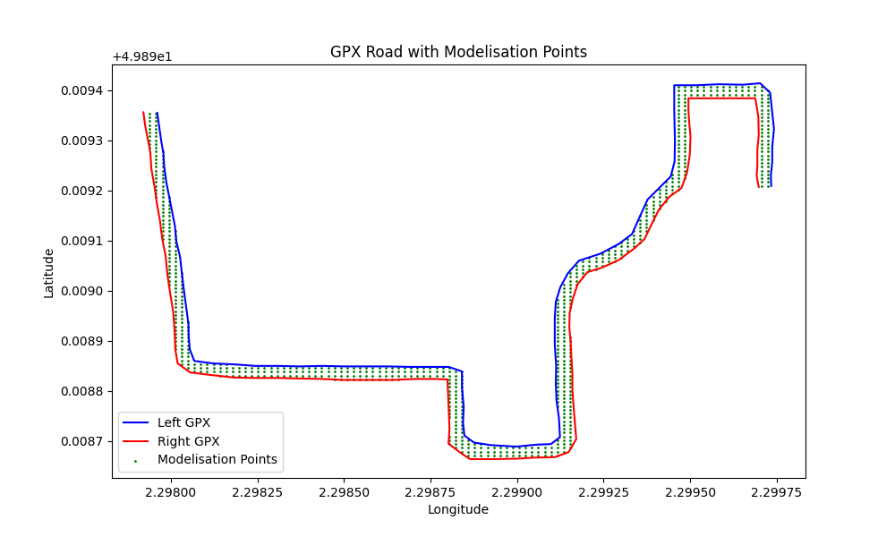

# Marathon Blue Line

This project was carried out as part of the ISRI Master's Degree 2 course at the Université de Picardie Jules Verne, as part of the “Projet Thématique 1” module.

## Goal

The aim is to determine the **blue line** of a marathon course, i.e. **the shortest path** that runners can take, based on GPX files representing the two edges of the road.

## Methods used

### 1. Modelisation

#### First modelisation : grid box

To model the space between the two edges of the road (represented by two GPX tracks), we firstly used a grid-based approach. This approach discretizes the area between the left and right GPX curves into a dense grid of points and identifies the points that fall within the road boundary.

To perform geometric operations efficiently and accurately, we used the `Shapely` library, which provides powerful tools for manipulating and analyzing planar geometric objects.

Steps involved:
1. Defining the Road Area:
    - Each side of the road is transformed into a `LineString` object using the Shapely library.
    - A `Polygon` is then constructed by connecting the left line with the reversed right line, effectively forming a closed shape representing the road surface.
2. Creating the Grid:
    - A regular grid of latitude and longitude points is created using `np.linspace` across the bounding box that encloses both curves.
    - The density of this grid is controlled by the `grid_density` parameter, which specifies the number of points per axis.
3. Filtering Points Inside the Road:
    - For each point in the grid, a `Point` object is created.
    - Using `Shapely`, the code checks whether the point lies within the polygon representing the road.
    - Only points inside the polygon are retained as valid parts of the model.

This grid of points is the first step toward computing the blue line. It provides a discretized representation of the allowed running area, which can then be used in pathfinding algorithms (e.g. Dijkstra or A*) to determine the shortest valid route from start to finish.

A visual representation is available using the `plot_modelisation` function, which overlays the modelled grid onto the original GPX curves.

**Limits:**
Although functional, this approach had several drawbacks, which led us to discard it in later stages:
- **Inefficiency**: The grid-based model generates a large number of points, especially as grid density increases. Most of these points do not contribute meaningfully to determining the shortest path.
- **Irrelevance of many points**: Many of the grid points lie in regions of the road that are far from the optimal path. This results in unnecessary complexity for subsequent pathfinding algorithms.
- **Long computation time**: Generating the grid and testing each point for inclusion in the polygon can take a long time, especially for longer routes or higher grid densities.

### 2. Solving algorithms

### 3. Project structure

### 4. Utils

1. `read_gpx`: function that reads a GPX file and returns a list of coordinates
2. `plot_gpx`: function that displays a road from two GPX files
3. `plot_modelisation`: A function that displays a road from two GPX files, as well as a modelisation within it.

## Installation and running

### Requierements

### Installation

### Running

## References

